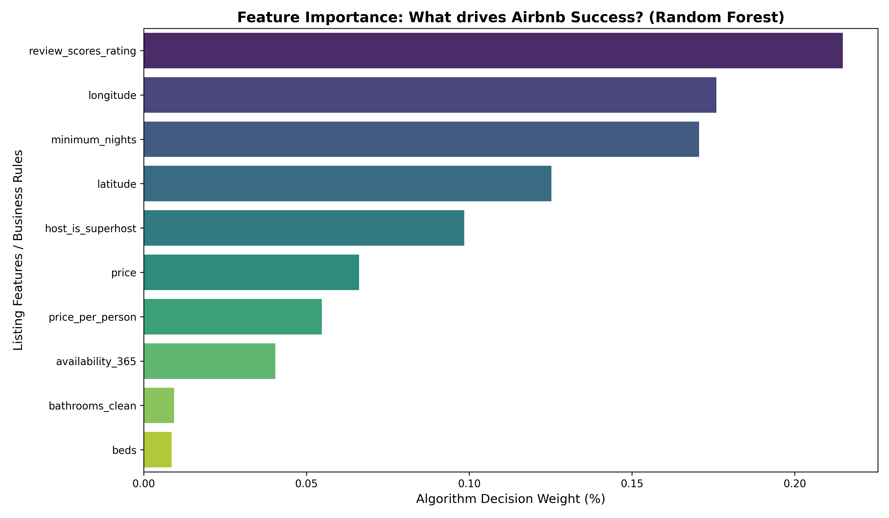
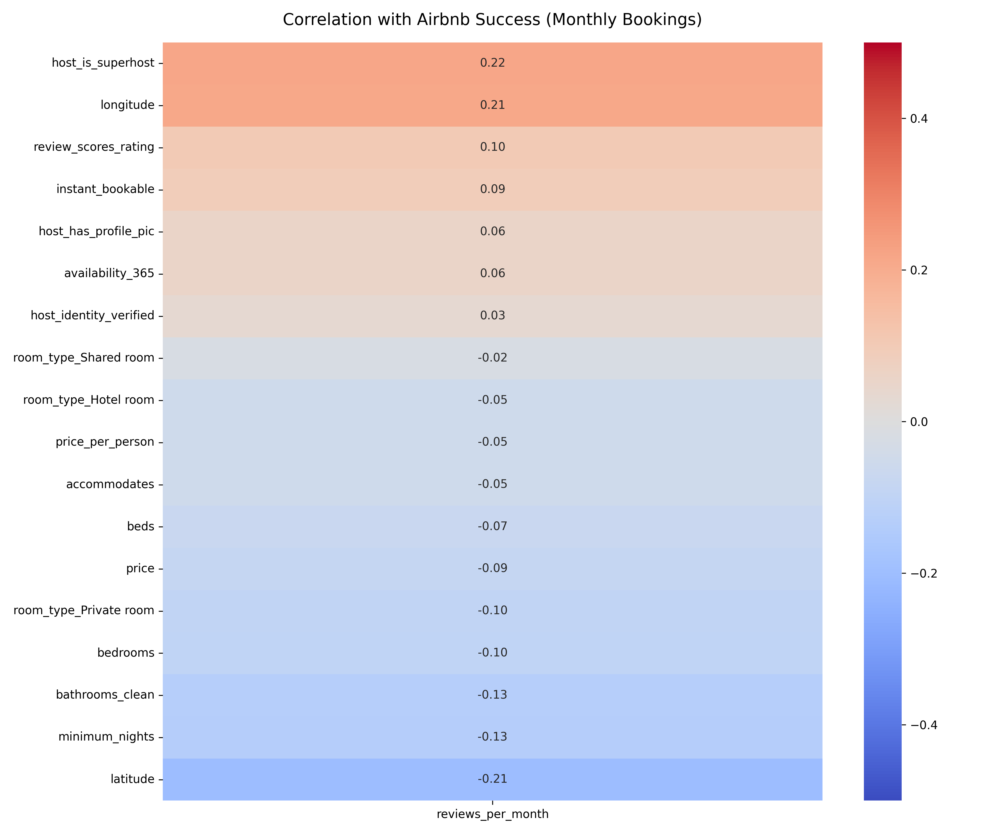
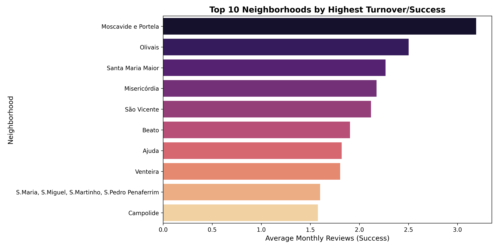
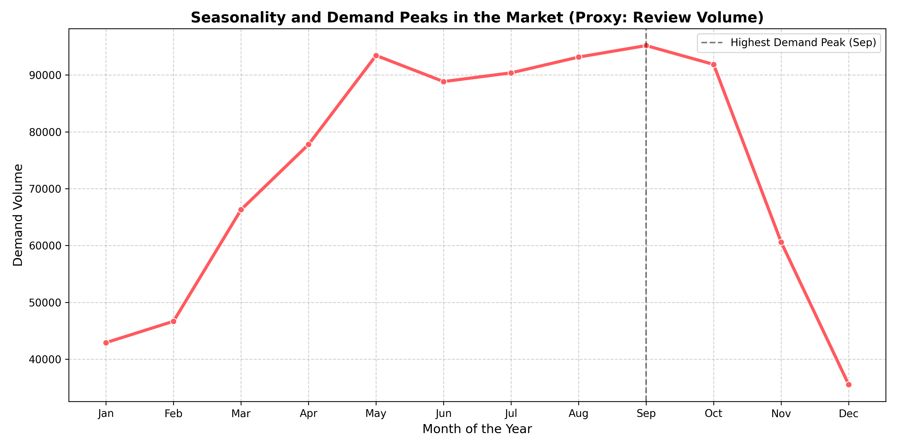
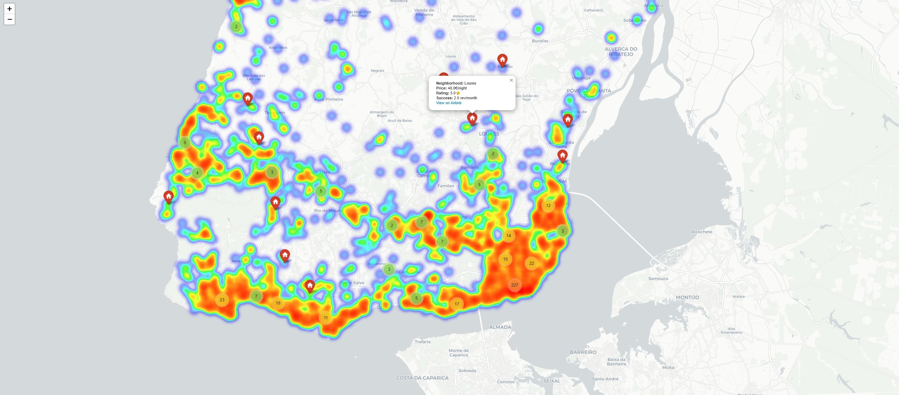

# 🏡 Airbnb Market Analysis: Predicting Success, Seasonality & Geo-Trends

## 🎯 The Business Challenge
In the Short-Term Rental (STR) market, property managers and investors constantly face three critical questions:
1. **What drives success?** Is it price, property size, or perceived quality/trust?
2. **Where are the hidden hotspots?** How is demand distributed beyond the obvious city center?
3. **When does the market actually peak?** When should Pricing and Marketing teams deploy their strategies?

This end-to-end Data Science project answers these questions using real Airbnb data from the Lisbon & Coastal region, applying Data Engineering, Machine Learning, Geospatial Mapping, and Time Series Analysis to extract actionable market intelligence.

---

## 🛠️ Tech Stack & Methodology
* **Language:** Python (Jupyter Notebooks)
* **Data Engineering:** `pandas`, `numpy` (Handling nulls, financial formatting via Regex, text extraction, engineering business metrics like *Value for Money*).
* **Machine Learning:** `scikit-learn` (*Random Forest Regressor* for non-linear feature importance).
* **Time Series:** Date/Time manipulation (`datetime`) and relational database joins (*Inner Joins*). Filtered from 2023 onwards to capture current market trends.
* **Geospatial Analysis:** `folium`, `seaborn`, `matplotlib`.

---

## 📊 Key Insights & Business Intelligence

### 1. Trust & Quality Beat Price Wars (Feature Importance)
Many analysts assume that lower prices or larger homes dictate booking volume. The non-linear *Random Forest* model proved otherwise:
* **The Supreme Driver:** Guest experience and trust (`review_scores_rating`) is overwhelmingly the most important factor (~21% decision weight).
* **The Biggest Barrier:** Restrictive policies, specifically `minimum_nights`, act as the primary friction point for conversion. Flexibility wins.
* **Business Takeaway:** In the tourism market, visual/social trust converts at a higher rate than aggressive pricing. 

*(Generated via Random Forest Regressor)*

### 2. The Linear Impact (Correlation Matrix)
The correlation matrix confirms the machine learning findings and adds a geographical layer:
* Being a *Superhost* (+0.22) and Location (`longitude` +0.21, `latitude` -0.21) are the strongest positive drivers for monthly bookings. 
* Increasing prices and minimum stay requirements actively penalize booking rotation.

### 3. Transit Tourism vs. Historic Leisure (Neighborhood Turnover)
Analyzing success by neighborhood revealed a surprising dynamic:
* **The Transit Goldmine:** The highest turnover (bookings per month) doesn't come from the historic center, but from neighborhoods adjacent to the Airport and the main corporate/event hub (Moscavide e Portela, Olivais). Short, 1-night transit stays generate massive review volume.
* **The Spillover Effect:** High performance in peripheral suburbs (e.g., Venteira) proves that guests are trading central locations for better *Value for Money* near train lines.

### 4. Seasonality & The "Review Lag" (Time Series)
By joining static listing data with historical interactions, we mapped the annual demand curve. *Note: To ensure relevance to post-pandemic market dynamics, only data from **2023 onwards** was analyzed.*
* **The Time-Lag Effect:** Reviews are submitted *after* the guest's stay (up to a 14-day window). Therefore, the visible review peak in **September** actually reflects the absolute peak of physical occupancy that occurred 15 to 30 days prior, in **August**.
* **Business Takeaway:** Knowing that peak occupancy hits in August, and factoring in the international booking lead time (30-60 days), Pricing and Marketing teams must finalize their peak-season strategies and launch campaigns no later than **June** to capture the demand wave.

### 5. Geospatial Intelligence (Interactive Heatmap)
To visualize market saturation, an interactive map was generated using `folium`.
* The heatmap highlights extreme saturation in Lisbon's urban core but reveals a continuous, high-density demand belt along the entire coastline (Cascais, Sintra, Ericeira).
* The script overlays thermal density with individual price/performance markers, serving as a practical tool for Revenue Managers.

*(Note: The `interactive_airbnb_map.ipynb` notebook generates a fully interactive `.html` file).*

---

## 🚀 How to Reproduce This Project
1. Clone this repository.
2. Download the raw datasets from the *Inside Airbnb* portal. For this project, we used the detailed **`listings.csv.gz` (Lisbon, June 2025)** and the historical **`reviews.csv` (Lisbon, December 2025)**.
3. Open and run the Jupyter Notebooks in the following pipeline order:
   * 🧹 `clean_dataset.ipynb` (Data cleaning and feature engineering)
   * 🤖 `ml_Airbnb.ipynb` (Correlation and Random Forest modeling)
   * 🏙️ `success_neighborhood.ipynb` (Geographic turnover analysis)
   * 📈 `time_series_analysis.ipynb` (Seasonality and demand peaks)
   * 🗺️ `interactive_airbnb_map.ipynb` (Generates the interactive `.html` map)